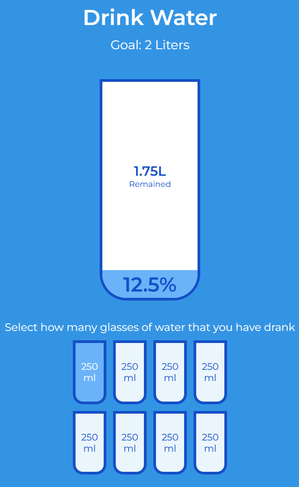
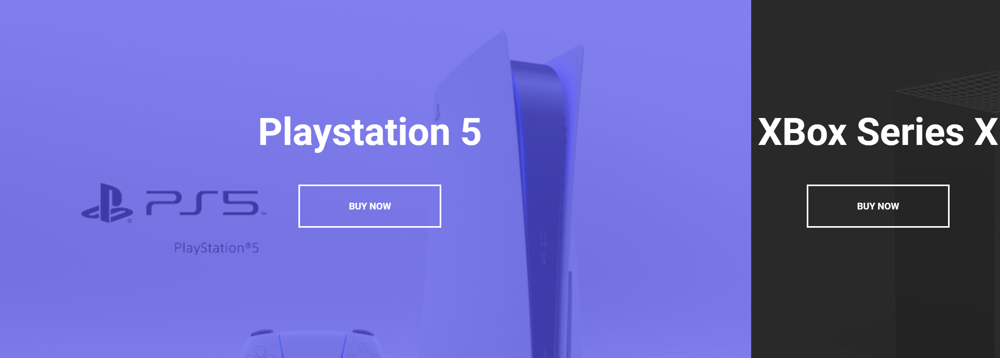
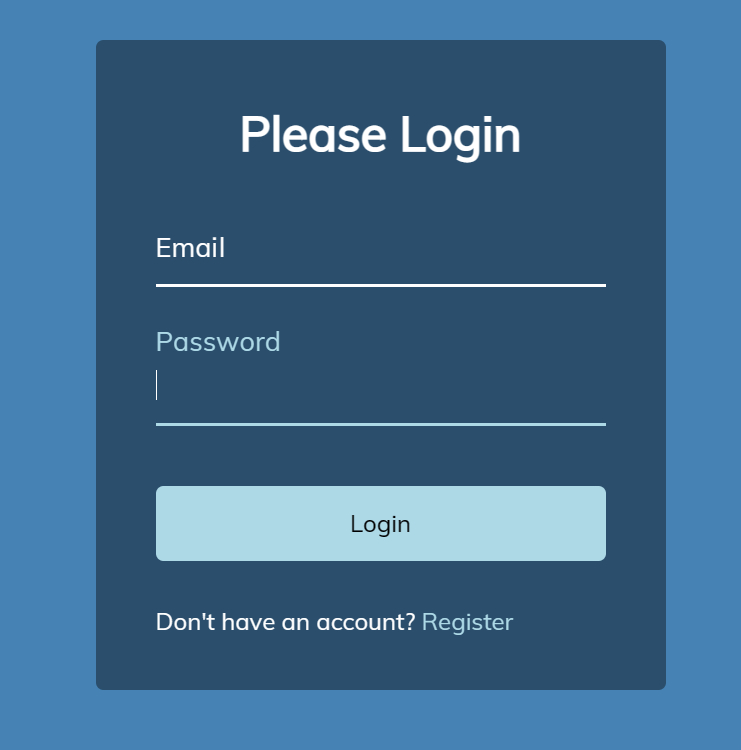

[toc]

# CSS案例

## 一. testimonial-box-switcher

- 动画加载切换


核心代码

```css
/* 进度条设置 */
.progress-bar {
  background-color: #fff;
  height: 4px;
  width: 100%;
  /* 动画 5s 线性 无穷 */
  animation: grow 5s linear infinite;
  /* 起始点 */
  transform-origin: right;
}

/* 定义动画 */
@keyframes grow {
  0% {
    transform: scaleX(0);
  }
  100% {
    transform: scaleX(1);
  }
}

/* 媒体查询, 以适应更多尺寸的屏幕 */
@media (max-width: 768px) {
  .testimonial-container {
    padding: 20px 30px;
  }

  .fa-quote {
    display: none;
  }
}
```

```js
// 一定时间切换内容, 与动画时间保持一致
setInterval(updateTestimonial, 5000);
```


## 二. sticky-navigation

核心代码

```js
// 监听滚动事件
window.addEventListener("scroll", fixNav);
// 当滚动距离达到一定值, 添加active属性
function fixNav() {
  if (window.scrollY > nav.offsetHeight + 150) {
    nav.classList.add("active");
  } else {
    nav.classList.remove("active");
  }
}
```

```css
/* 设置当添加active类时, 触发的覆盖属性 */
.nav.active .container {
  padding: 10px 0;
}
```


## 三 custom range slider

- 自定义滑块

```js
input[type="range"] {
  width: 300px;
  margin: 18px 0;
  /* 取消默认滑块的系统设置 */
  appearance: none;
}

input[type="range"]:focus {
  outline: none;
}

input[type="range"] + label {
  background-color: #fff;
  position: absolute;
  top: -25px;
  left: 110px;
  width: 80px;
  padding: 5px 0;
  text-align: center;
  border-radius: 4px;
  box-shadow: 0 0 5px rgba(0, 0, 0, 0.3);
}

/* 自定义滑轨 */
input[type="range"]::-webkit-slider-runnable-track {
  background-color: purple;
  border-radius: 4px;
  width: 100%;
  height: 10px;
  cursor: pointer;
}

/* 自定义滑块 */
input[type="range"]::-webkit-slider-thumb {
  appearance: none;
  height: 24px;
  width: 24px;
  background-color: #f5f7fa;
  border-radius: 50%;
  border: 1px solid purple;
  margin-top: -7px;
  cursor: pointer;
}

/* 定义在不同的浏览器上的样式 */
input[type="range"]::-moz-range-track {
  background: purple;
  border-radius: 4px;
  width: 100%;
  height: 13px;
  cursor: pointer;
}

input[type="range"]::-moz-range-thumb {
  -webkit-appearance: none;
  height: 24px;
  width: 24px;
  background: #fff;
  border-radius: 50%;
  border: 1px solid purple;
  margin-top: -7px;
  cursor: pointer;
}
```


## 四. netflix-mobile-navigation

- 三个方块依次弹出


```css
.nav {
  position: fixed;
  top: 0;
  left: 0;
  height: 100vh;
  /* 先全部移致不可见 */
  transform: translateX(-100%);
  transition: transform 0.3s ease-in-out;
}

/* 在父元素上设置对子元素也会产生影响, 因此如果父子元素都设置了, 则子元素会多移动一次 */
.nav.visible {
  transform: translateX(0);
}

/* 每个色块再设置不同的显示或隐藏延时 */
.nav-black {
  background-color: rgb(34, 31, 31);
  width: 60%;
  max-width: 480px;
  min-width: 320px;

  /* 隐藏时动画延迟 */
  transition-delay: 0.4s;
}

.nav-black.visible {
  /* 显示时动画延迟 */
  transition-delay: 0s;
}
```

```js
openBtn.addEventListener("click", () => {
  navBars.forEach((nav) => {
    nav.classList.add("visible");
  });
});
```


## 五. todo-list


```js
function addTodo(todo) {
  const todoEl = document.createElement("li");
  if (todo && todo.completed) {
    todoEl.classList.add("completed");
  }
  todoEl.innerText = todo.text;
  // 每个列表都设置一个点击事件
  todoEl.addEventListener("click", () => {
    todoEl.classList.toggle("completed");
  });
  // 设置鼠标右键的事件, 取消默认的行为
  todoEl.addEventListener("contextmenu", (e) => {
    e.preventDefault();
    todoEl.remove();
    updateLS();
  });
  // 将子元素加入
  todosUL.appendChild(todoEl);

  input.value = "";

  updateLS();
}
```

```css
.todos li {
  border-top: 1px solid #e5e5e5;
  cursor: pointer;
  font-size: 1.5rem;
  padding: 1rem 2rem;
}

.todos li.completed {
  color: #b6b6b6;
  text-decoration: line-through;
}
```


## 六. hidden search

- 点击展开的搜索框

```css
/* btn被绝对定位了, 因此会覆盖到缩小的input上 */
.btn {
  background-color: #fff;
  border: 0;
  cursor: pointer;
  font-size: 24px;
  position: absolute;
  top: 0;
  left: 0;
  height: 50px;
  width: 50px;
  transition: transform 0.3s ease;
}

.btn:focus,
.input:focus {
  outline: none;
}

/* 当点击触发active时, 调整搜索框的宽度 */
.search.active .input {
  width: 200px;
}

/* 在点击显示按钮时再之前的基础上, 向右移动一定距离 */
.search.active .btn {
  transform: translateX(198px);
}
```


## 七. expanding cards


```scss
.panel {
  background-size: cover;
  background-position: center;
  background-repeat: no-repeat;
  height: 80vh;
  border-radius: 50px;
  color: #fff;
  cursor: pointer;
  // 在flex布局中的比例
  flex: 0.5;
  margin: 10px;
  position: relative;
  transition: all 700ms ease-in;

  h3 {
    font-size: 24px;
    position: absolute;
    bottom: 20px;
    left: 20px;
    margin: 0;
    opacity: 0;
  }
}

// 核心, 给active的元素赋予在flex父级元素上更高的比例, 并加上动画
.panel.active {
    // 改变盒子在整个flex中的比重
  flex: 5;
  h3 {
    opacity: 1;
    transition: opacity 0.3s ease-in 0.4s;
  }
}

```


## 八. 3D Boxes Background


```css
.box {
  background-image: url('https://media.giphy.com/media/EZqwsBSPlvSda/giphy.gif');
  background-repeat: no-repeat;
  background-size: 500px 500px;
  position: relative;
  height: 125px;
  width: 125px;
  transition: 0.4s ease;
}

/* 设置右侧阴影 */
.box::after {
  content: '';
  background-color: #f6e58d;
  position: absolute;
  top: 8px;
  right: -15px;
  height: 100%;
  width: 15px;
  transform: skewY(45deg);
}
/* 设置底部阴影 */
.box::before {
  content: '';
  background-color: #f9ca24;
  position: absolute;
  bottom: -15px;
  left: 8px;
  height: 15px;
  width: 100%;
  transform: skewX(45deg);
}

/* 合并在一起的大小 */
.boxes {
  display: flex;
  flex-wrap: wrap;
  justify-content: space-around;
  height: 500px;
  width: 500px;
  position: relative;
  transition: 0.4s ease;
}

/* 拆开后变大 */
.boxes.big {
  width: 600px;
  height: 600px;
}
/* 动画旋转 */
.boxes.big .box {
  transform: rotateZ(360deg);
}


```

```js
const boxesContainer = document.getElementById('boxes')
const btn = document.getElementById('btn')

btn.addEventListener('click', () => boxesContainer.classList.toggle('big'))
// 动态生成boxes
function createBoxes() {
  for (let i = 0; i < 4; i++) {
    for (let j = 0; j < 4; j++) {
      const box = document.createElement('div')
      box.classList.add('box')
      box.style.backgroundPosition = `${-j * 125}px ${-i * 125}px`
      boxesContainer.appendChild(box)
    }
  }
}

createBoxes()
```


## 九. drawing app

```html
<canvas id="canvas" width="800" height="700"></canvas>
<div class="toolbox">
  <button id="decrease">-</button>
  <span id="size">10</span>
  <button id="increase">+</button>
  <input type="color" id="color">
  <button id="clear">X</button>
</div>
```

```js
// 主要都是以监听事件为主
```


## 十. theme clock

```css
/* 时, 分, 秒三个指针 */
.needle {
  background-color: var(--primary-color);
  position: absolute;
  top: 50%;
  left: 50%;
  height: 65px;
  width: 3px;
  transform-origin: bottom center;
  transition: all 0.5s ease-in;
}

.needle.hour {
  /* 这里进行转换是为了将所有指针移到12点的位置 */
  transform: translate(-50%, -100%) rotate(0deg);
}

.needle.minute {
  transform: translate(-50%, -100%) rotate(0deg);
  /* 时针和分针设置长一点 */
  height: 100px;
}

.needle.second {
  transform: translate(-50%, -100%) rotate(0deg);
  height: 100px;
  background-color: #e74c3c;
}
```

```js
// 获取时间, 调整旋转角度
function setTime() {
    const time = new Date();
    const month = time.getMonth()
    const day = time.getDay()
    const date = time.getDate()
    const hours = time.getHours()
    const hoursForClock = hours >= 13 ? hours % 12 : hours;
    const minutes = time.getMinutes()
    const seconds = time.getSeconds()
    const ampm = hours >= 12 ? 'PM' : 'AM'

    hourEl.style.transform = `translate(-50%, -100%) rotate(${scale(hoursForClock, 0, 12, 0, 360)}deg)`
    minuteEl.style.transform = `translate(-50%, -100%) rotate(${scale(minutes, 0, 60, 0, 360)}deg)`
    secondEl.style.transform = `translate(-50%, -100%) rotate(${scale(seconds, 0, 60, 0, 360)}deg)`

    timeEl.innerHTML = `${hoursForClock}:${minutes < 10 ? `0${minutes}` : minutes} ${ampm}`
    dateEl.innerHTML = `${days[day]}, ${months[month]} <span class="circle">${date}</span>`
}
```


## 十一. drink water



- 主要通过js设置`visibility`和`height`属性

```js
if(fullCups === 0) {
        percentage.style.visibility = 'hidden'
        percentage.style.height = 0
    } else {
        percentage.style.visibility = 'visible'
        percentage.style.height = `${fullCups / totalCups * 330}px`
        percentage.innerText = `${fullCups / totalCups * 100}%`
    }

    if(fullCups === totalCups) {
        remained.style.visibility = 'hidden'
        remained.style.height = 0
    } else {
        remained.style.visibility = 'visible'
        liters.innerText = `${2 - (250 * fullCups / 1000)}L`
    }
```


## 十二. split-landing-page



```js
// 主要是监听mouseenter和mouseleave两个事件
// 当添加hover-left类时, 再修改左右盒子的宽度大小
left.addEventListener('mouseenter', () => container.classList.add('hover-left'))
left.addEventListener('mouseleave', () => container.classList.remove('hover-left'))

right.addEventListener('mouseenter', () => container.classList.add('hover-right'))
right.addEventListener('mouseleave', () => container.classList.remove('hover-right'))
```

```css
/* 左右两块采用绝对定位的方式分开, 一个left: 0, 一个right: 0 */
/* 我认为用flex也是可以实现的 */
/* 每个块中的元素相对这个块也是绝对定位的 */
```


## 十三. sound-board

```js
 btn.addEventListener('click', () => {
        stopSongs()

        document.getElementById(sound).play()
    })

    document.getElementById('buttons').appendChild(btn)
```

```html
 <audio id="applause" src="sounds/applause.mp3"></audio>
    <audio id="boo" src="sounds/boo.mp3"></audio>
    <audio id="gasp" src="sounds/gasp.mp3"></audio>
    <audio id="tada" src="sounds/tada.mp3"></audio>
    <audio id="victory" src="sounds/victory.mp3"></audio>
    <audio id="wrong" src="sounds/wrong.mp3"></audio>

    <div id="buttons"></div>
```


## 十四. Form Input wave



```js
// 给label中的每个字都添加上单独的动画延时
const labels = document.querySelectorAll(".form-control label");

labels.forEach((label) => {
  console.log(label);
  label.innerHTML = label.innerText
    .split("")
    .map(
      (letter, idx) =>
        `<span style="transition-delay:${idx * 50}ms">${letter}</span>`
    )
    .join("");
});

```

```css
/* 进行相对定位 */
.form-control {
  position: relative;
  margin: 20px 0 40px;
  width: 300px;
}

.form-control input {
  background-color: transparent;
  border: 0;
  border-bottom: 2px #fff solid;
  display: block;
  width: 100%;
  padding: 15px 0;
  font-size: 18px;
  color: #fff;
}


.form-control label {
  position: absolute;
  top: 15px;
  left: 0;
  pointer-events: none;
}

.form-control label span {
  display: inline-block;
  font-size: 18px;
  min-width: 5px;
  transition: 0.3s cubic-bezier(0.68, -0.55, 0.265, 1.55);
}

.form-control input:focus + label span,
.form-control input:valid + label span {
  color: lightblue;
  transform: translateY(-30px);
}

```

