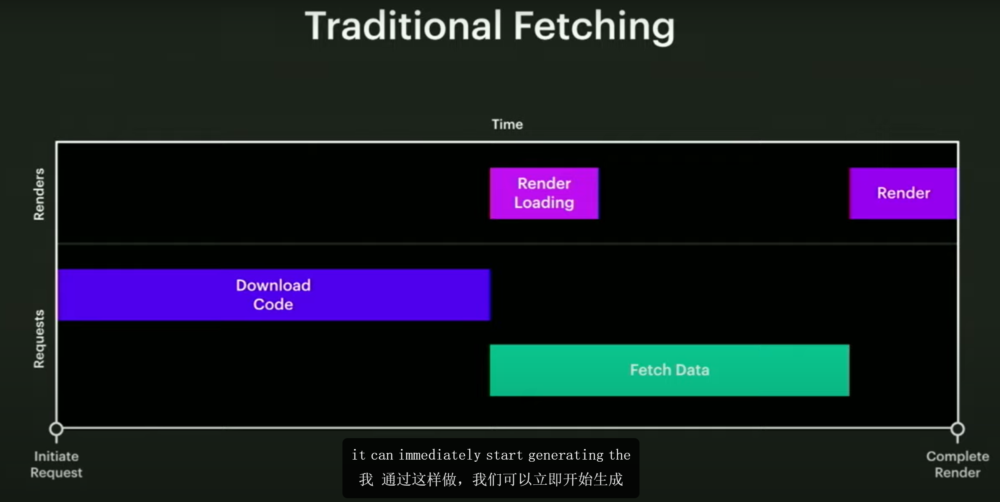
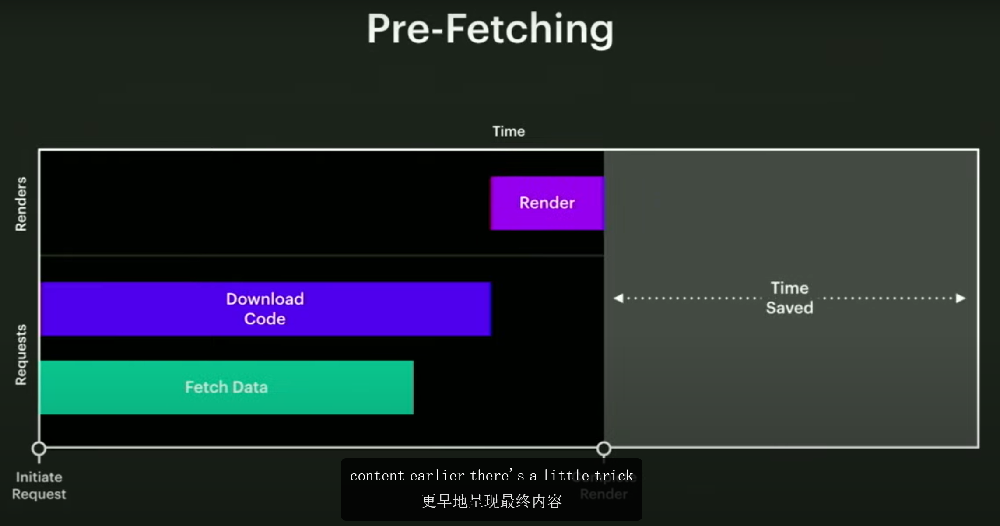
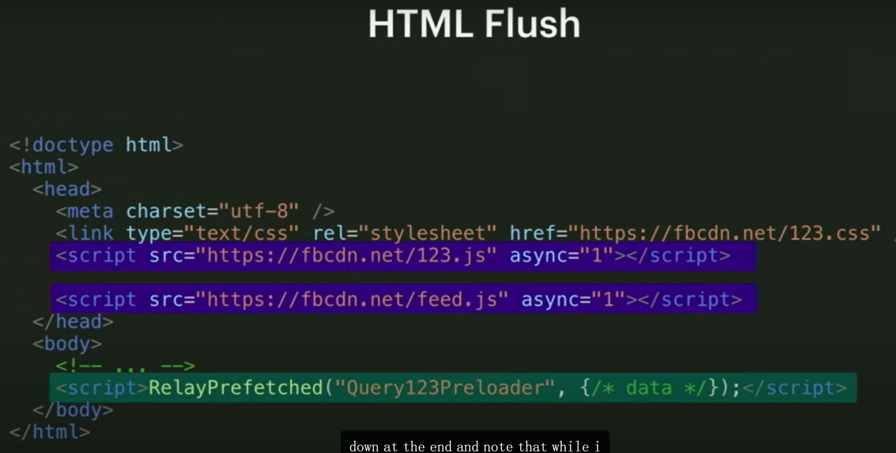
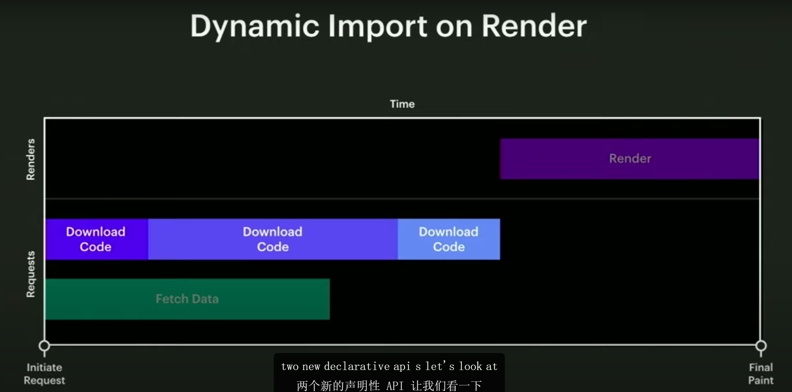
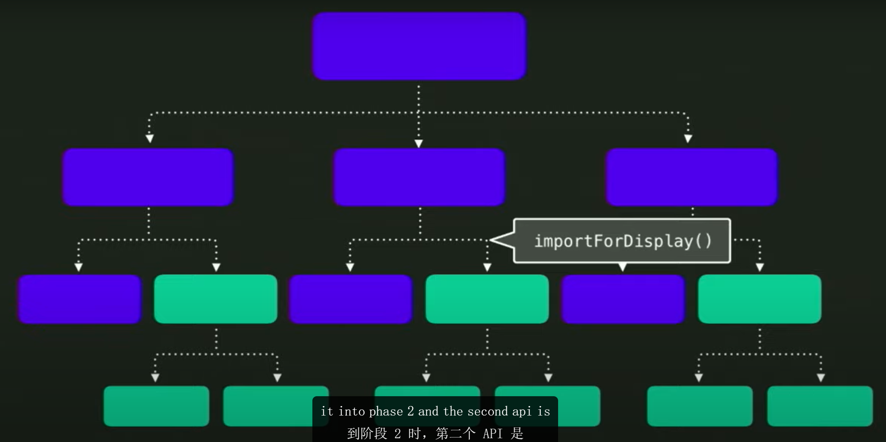
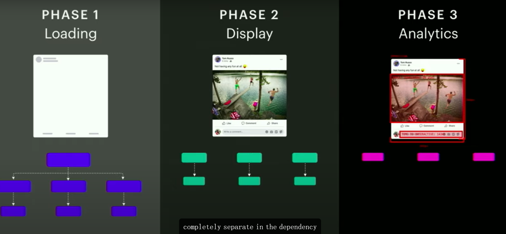
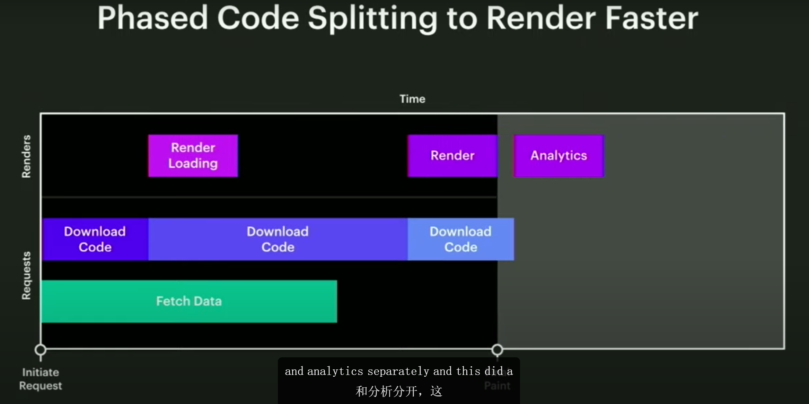
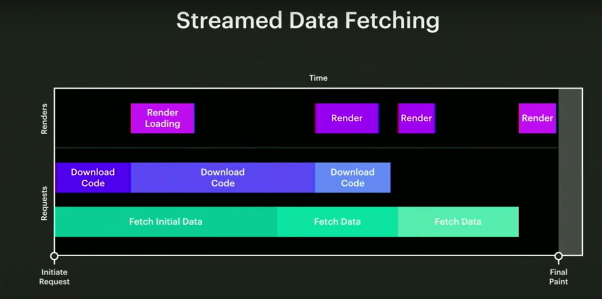

[toc]

# Relay

- 因为relay为我们掌管所有的data fetch, 所以它静态的直到需要什么数据, 他对整个系统的数据需求有全局的了解,  所以当服务器收到客户端的请求时, 就立马请求数据, 并与代码并行的下载它

## HTML flushing(HTML 刷新)

- 当浏览器请求一个HTML文档时, 它会以网络数据包(packages)的形式接收响应, 然后会逐步解析HTML, 这会在整个HTML被完全下载下来之前就开始运行

- 因此可以将一些CSS和js放到HTML的head靠前的位置, 这样它们就会先下载, 后续

## Dynamic Import on render

### 将代码分为三个阶段

## streamed Data Fetch

