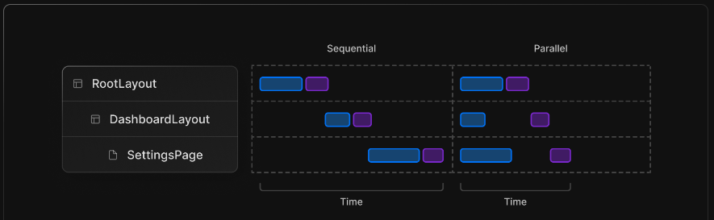
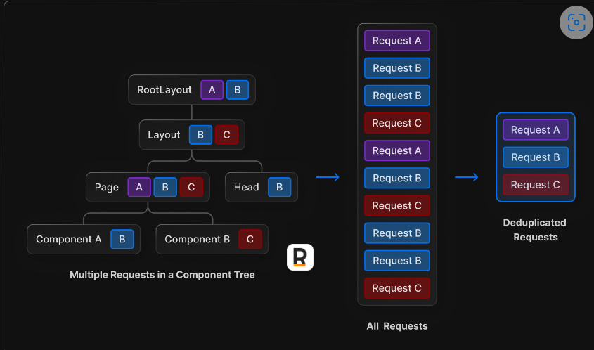
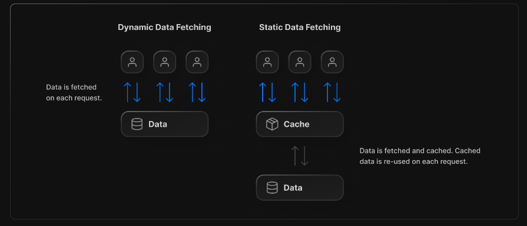
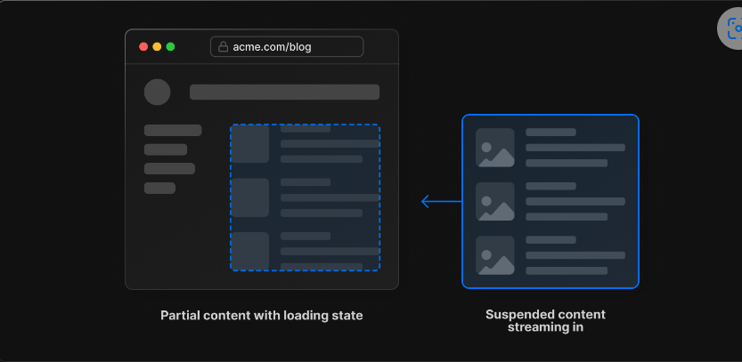
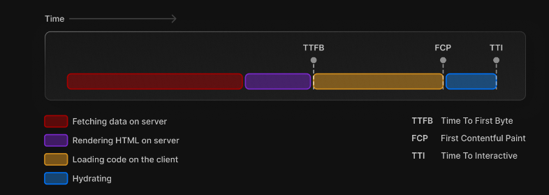
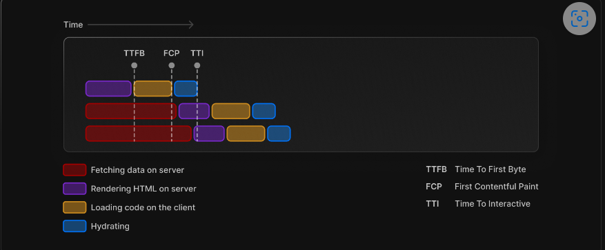

[toc]

# Data fetching

## 一. overview

- 在新的`app`目录下, 不在支持使用`getServerSideProps`, `getStaticProps`,`getInitialProps`三个函数

### 1.1 data fetching system

- 新的data fetching system是在`fetch()`这个API上构成的, 并使用`await/async`
  - 尽量在server component中进行fetch data, 但也能在client component中fetch data, 当推荐搭配一些第三方库使用, 比如 [SWR](https://swr.vercel.app/) or [React Query](https://tanstack.com/query/v4/)


### 1.2 data fetching patterns




- 在component中fetch data的两种方式:

- Parrallel data fetching(并行模式)
  - 并行模式会在路由中同时发起多个请求, 减少了客户端和服务器之间的等待时间, 也缩短了加载数据的总时间

- Sequential data fetching(串行模式)
  - 串行数据获取会使请求相互依赖, 导致加载数据的瀑布式流程. 一个fetch依赖另一个fetch的结果, 但可能导致加载时间变长

### 1.3 自动请求去重(automatic fetch request deduping)

- React继承的`fetch`, 并提供了自动请求去重
  - 自动请求去重(automatic request deduping): 在React通过fetch方法发送请求时, React会自动检查当前正在进行的请求是否与之前已经发送的请求相同, 如果相同则不会重复发送请求, 而是返回之前已经发送请求的响应结果, 减少网络流量和服务器的负载, 提高应用性能
  - `POST`请求不会被自动去重

- 如果你在组件树中的多个组件中请求获取到了相同的数据(例如当前用户), Next.js会自动将具有相同输入的fetch请求(GET)缓存到临时缓存中, 这个优化避免了在渲染过程中多次获取相同的数据



- 在server端的缓存仅在渲染进程完成之前的服务器请求的生命周期内存在. 
  - 这种优化仅适用于在Layouts, pages, Server Component, `generateMetaData` `generateStaticparams` 中进行`fetch`请求
  - 同时这种优化也适用于静态生成(static generation || static rendering)
- 在client端的缓存会持续一个会话(session)的时间, 其中可能包括多个客户端重新渲染, 在进行完整页面重载之前


### 1.4 Static and Dynamic Data Fetches

- Static Data: 不经常改变, 比如一篇blog
  - 减少数据库的负载, 因为它最大程度减少了请求次数
  - 数据会被自动缓存, 以提高加载性能
- Dynamic Data: 可能会经常改变, 或者可以特定于用户的数据, 如: 购物车列表


- 默认情况下, Next.js会自动在build阶段进行static fetches, 并将结果缓存, 并在之后被重复使用, 作为开发者, 我们要控制static data被如何缓存和重新验证revalidated



### 1.5 revalidating data

- Revalidation 是指清除缓存并重新获取最新数据的过程. 当数据发生改变时, 可以保证获取最新的数据, 而无需重新构建整个应用程序
- 两种重新验证类型
  - `Background`: 以特定的时间间隔进行重新验证
  - `On-denmand`: 按需, 当数据发生改变时就进行更新


### 1.6 Streaming and Suspense

- Streaming和suspense允许你逐步的渲染和递增地将UI的渲染单元流式传输到客户端
- 利用Server component和嵌套布局, 你能立即呈现不需要数据的页面部分, 并显示出正在获取数据的页面部分的加载状态, 这也意味着用户不用等待整个页面加载完成才能开始与页面进行交互




## 二. Data Fetching

### 1. async/await in Server component

- 通过[proposed React RFC](https://github.com/acdlite/rfcs/blob/first-class-promises/text/0000-first-class-support-for-promises.md)这篇博客的介绍, 你能在Server Component中直接使用`async/await`


- Server Component Functions
  - `cookies()`
  - `headers()`


### 2. `use` in Client Component

- `use`是一个**接收Promise**在概念上与`await`相似的React function, 它与components, hooks, suspense 是相互兼容的
- 现在在Client Component使用`use`, 如`use(fetch(url))`是不推荐, 可能会导致重复渲染. 现在更推荐的是在Client Component中使用 [SWR](https://swr.vercel.app/) or [React Query](https://tanstack.com/query/v4).


### 3. Static Data Fetching(default)

- 默认情况下`fetch`会自动缓存获取的数据, `force-cache`是默认的

```js
fetch('https://...')
```

#### 1.  Revalidating Data

- `Revalidating`:清除缓存, 重新获取新内容, 以秒(s)为单位

```js
fetch('https://...', { next: { revalidate: 10 } })
```


### 4. Dynamic Data Fetching

- 每次`fetch`都想要获得最新的数据, 不需要建立缓存

```js
fetch("https://...", { cache: 'no-store' })
```


### 5. Data Fetching Patterns

#### 1. Parallel Data Fetching

- 可以减小`client-server`之间的waterfalls(数据瀑布)
- 手动实现, 利用`Promise.all()`这个API
- 最好同时使用`<Suspense/>`, 提高用户体验

```js
import Albums from './albums';

async function getArtist(username) {
  const res = await 		fetch(`https://api.example.com/artist/${username}`);
  return res.json();
}

async function getArtistAlbums(username) {
  const res = await fetch(`https://api.example.com/artist/${username}/albums`);
  return res.json();
}


export default async function Page({ params: { username } }) {
  // Initiate both requests in parallel
  const artistData = getArtist(username);
  const albumsData = getArtistAlbums(username);

  // Wait for the promises to resolve
  const [artist, albums] = await Promise.all([artistData, albumsData]);

  return (
    <>
      <h1>{artist.name}</h1>
      <Albums list={albums}></Albums>
    </>
  );
}
```

#### 2. Sequential Data Fetching

- 前后请求的数据存在依赖关系, 会形成waterfall


#### 3. Blocking Rendering in a Route

- 在`layout`中获取数据, 会在数据加载完成前, 阻塞`layout`其下所有部分的渲染, 因此数据获取最好只在其使用的部分


### 6. Data Fetching without `fetch()`

- 如果你不打算使用`fetch()`, 比如正在使用一些第三方库, 或者数据库客户端, 这种情况下, 如果你控制页面的缓存和重新验证(caching and revalidating)行为

#### 1. Default Caching Behavior

- 第三方库中如果没有使用`fetch`, 则不会对缓存产生影响, , 由其所在的route segment决定static or dynamic
- 如果这个segment是static(default), 那么这个request的结果就会被缓存, 如果这个segment是dynamic, 则这个请求的结果不会被缓存
  - 使用了`cookies()`或者`headers()`这种函数


#### 2. Segment Cache Configuration

- 利用`segment configuration`去自定义cache behavior

```js
import prisma from './lib/prisma';
// 自定义
export const revalidate = 3600; // revalidate every hour

async function getPosts() {
  const posts = await prisma.post.findMany();
  return posts;
}

export default async function Page() {
  const posts = await getPosts();
  // ...
}
```


## 三. Caching Data

- Next.js中有两种缓存: 
  - Segment-level Cache
  - Per-Request Cache(每个请求的缓存)

### 1. Segment-level Caching

- Segment-level缓存允许您单独缓存和重新验证用于路由段的数据(route segment)

- 这种机制允许你在不同的路由段数据中使用不同的缓存机制(比如:不同的revalidate时间), 这使得你能更加细粒度地控制数据的缓存, 从而提高应用程序的性能和可扩展性

```js
export const revalidate = 60; // revalidate this page every 60 seconds
```

- 在`fetch()`中的`revalidate`也能控制这一行为
- 如果在`Layout`, `Page`, `fetch`中都设置了`revalidate`, 则其中最小的值会被应用

```js
// revalidate this page every 10 seconds, since the getData's fetch
// request has `revalidate: 10`.
async function getData() {
  const res = await fetch('https://...', { next: { revalidate: 10 } });
  return res.json();
}

export default async function Page() {
  const data = await getData();
  // ...
}
```


### 2. Per-request Caching(每个请求的缓存)

#### 2.1 介绍

- `Per-request`允许你能在每个请求的基础上进行缓存和去重

- 利用React 暴露的一个新函数`cache(callback)`, 返回一个函数, 如果这个函数接收到的是相同的函数, 则会直接返回结果, 而不是再调用一次, 因此你能利用这个`cache(callback)`对每个请求去重
- 但是, 像**`fetch()`已经自动在内部支持`cache()`, 因此不需要在fetch函数外包裹一层cache**, 你可以对一些第三方库的请求操作使用`cache()`
- 同时推荐使用`server-only`package保证server端的data fetching不会在client端被使用

```js
// utils/getUser.ts   单独提取出来
import { cache } from 'react';

export const getUser = cache(async (id: string) => {
  const user = await db.user.findUnique({ id });
  return user;
});
```

```js
// app/user/[id]/layout.tsx
import { getUser } from '@utils/getUser';

export default async function UserLayout({ params: { id } }) {
  const user = await getUser(id);
  // ...
}
```

```js
// app/user/[id]/page.tsx
import { getUser } from '@utils/getUser';

export default async function UserLayout({
  params: { id },
}: {
  params: { id: string };
}) {
  const user = await getUser(id);
  // ...
}
```

- 即使`getUser`函数会被调用两次, 当实际它只会运行一次, 第二次因为输入的参数相同, 会直接返回第一次调用的结果


#### 2.2 GraphQL and `cache()`

- 因为`POST`方法是不会被自动去重(deduplicated)的, 因此如果正在使用GraphQL和`POST`方法, 则可以使用`cache()`方法帮助去重

```js
import { cache } from 'react';

export const getUser = cache(async (id: string) => {
  const res = await fetch('/graphql', { method: 'POST', body: '...' })
  // ...
});
```


#### 2.3 Preload pattern with `cache()`

- 在`utilities`或者component中暴露一个`preload()`function进行数据获取
  - [void 运算符](https://developer.mozilla.org/zh-CN/docs/Web/JavaScript/Reference/Operators/void): 对给定的表达式进行求值, 然后返回`undefined`, 主要是为了执行表达式, 而不是求值, 可以防止表达式被计算后的值被意外的返回使用
- `preload`只是pattern, 而不是API, 因此这个函数可以使用任意的名字

```js
// component/User.tsx
import { getUser } from "@utils/getUser";

export const preload = (id) => {
  // void evaluates the given expression and returns undefined
  // 预加载进行缓存, 但不需要在这里获得值, 所以使用void关键字返回undefined
  void getUser(id);
}
export default async function User({ id }) {
  const result = await getUser(id);
  // ...
}
```

```js
// app/user/[id]/page.tsx
import User, { preload } from '@components/User';

export default async function Page({
  params: { id },
}: {
  params: { id: string };
}) {
  // 预获取
  preload(id); // starting loading the user data now
  const condition = await fetchCondition();
  return condition ? <User id={id} /> : null;
}
```


#### 2.4 Combining `cache`, `preload`, `server-only`

- 你可以将`cache`函数, `preload`模式, `server-only`包结合起来使用
  - 通过这种方式, 你能任意的fetch data, cache response 并且保证这种data fetch只发生在server端
  - 你能在`layouts`, `pages`,`components`中使用这个导出的函数`getUser`

```js
// utils/getUser.ts
import { cache } from 'react';
import 'server-only';

export const preload = (id: string) => {
  void getUser(id);
}

export const getUser = cache(async (id: string) => {
  // ...
});
```


## 四. Incremental Static Regeneration(增量静态再生)

- `Static Generation`传统的静态生成是一次性生成所有页面的内容, 然后将这些一次性生成的内容静态地提供给用户. 如果需要更改页面中的一部分, 需要重新生成所有的页面, 可能非常耗时(在有大量页面的情况下)
- `Incremental Static Regeneration`(ISR): 在不重新生成(build)的情况下更新和重新生成特定页面的部分内容, 可以只针对部分重新生成, 从而提高了更新速度


原理:

- 当用户首次请求页面时, Next.js会生成一个静态HTML页面, 并将其缓存, 然后, 他将开始"重新生成"这个页面的某些部分, 并将这些更新的部分缓存, 不用整个页面重新生成, 这些更新的部分可以在后续的请求中使用, 并且可以根据需要定期更新


## 五. Revalidating Data

- Next.js允许更新特定的静态路由, 而无需重新构建整个站点. Revalidating(重验证)也可称为ISR增量静态再生, 允许你保持静态的优点, 同时可以扩展到数百万的页面中

重验证的类型:

- `Background`(后台重验证): 以特定的时间间隔重验证数据
- `On-demand`(按需): 基于更新进行重验证

### 1. Background Revalidation

- 利用`fetch()`中的`next.revalidation`option来进行配置

```js
fetch('https://...', { next: { revalidate: 60 } });
```

- 如果不使用`fetch`函数, 则可以用下面这种方式

```js
export const revalidate = 60; // revalidate this page every 60 seconds
```

- 你也可以使用`cache`进行重验证, 如果没有发生更新(update)则会返回缓存值

#### 1.1 工作原理

1. 当请求一个在构建时是静态渲染的路由时, 它会最初显示缓存的数据, 
2. 在之后60s内对该路由发起的任何请求也都会被缓存, 且无需等待即可获得数据
3. 60s之后, 下一个请求仍然会显示缓存(过时)的数据
4. Next.js会在后台触发数据的重新生成
5. 一旦路由成功生成, Next.js就会使之前的缓存无效, 并且更新后的路由, 如果后台重新生成失败, 旧数据仍然不会改变

当对一个还没有生成的路由片段(route segment)发起请求时, Next.js将会在第一次请求时动态渲染路由. 之后的请求将从缓存中提供静态路由片段


## 2. On-demand Revalidation

- 如果你固定的将`revalidate`time设置为`60`, 那么所有的vistors在这一分钟内会看到完全相同的内容, 唯一使缓存失效的方式就是等待时间超时
- 因此你可以通过`On-demand Incremental Static Regeneration`按需增量静态生成去手动的清除Next.js的缓存, 这使得在下面的网站进行更新变得容易
  - 从你的 headless CMS创建或更新内容
  - 电子商务无数据更改(价格, 描述, 类别, 评论)

#### 2.1 Using On-demand Revalidation

1. 创建一个只有你的Next.js app知道的secret token, 这个key可以用来阻止对重验证API的未识别访问

```js
https://<your-site.com>/api/revalidate?secret=<token>
```

```js
// .env 天剑进环境变量
MY_SECRET_TOKEN=<token>
```

2. 然后在创建重验证的API Route

```js
export default async function handler(req, res) {
  // Check for secret to confirm this is a valid request
  if (req.query.secret !== process.env.MY_SECRET_TOKEN) {
    return res.status(401).json({ message: 'Invalid token' });
  }

  try {
    // This should be the actual path not a rewritten path
    // e.g. for "/blog/[slug]" this should be "/blog/post-1"
    // 不同的路由页面, 这里设置不同
    await res.revalidate('/path-to-revalidate');
    return res.json({ revalidated: true });
  } catch (err) {
    // If there was an error, Next.js will continue
    // to show the last successfully generated page
    return res.status(500).send('Error revalidating');
  }
}
```


### 3. Error Handling and Revalidation

- 如果在尝试重验证时, 抛出一个错误, 则会继续使用最后一次成功生成的route, 在之后的request中, Next.js会继续重新重验证


## 六. Mutation Data

- 当数据发生变更后, 你可以使用`router.refresh()`方法来刷新当前路由从根布局到下方的渲染(在server端获取新的更新后的数据并重新渲染)

- 在调用`router.refresh()`时, 它不会影响浏览器的历史(history), 但他缺失会重新刷新从root layout下来的数据, 并且client-side state和React 和Browser的stat都不会丢失
- 可以使用`useTransition`的`startTransition`function 去标记这个更新为一次transition, 利用isPending显示加载时的UI


## 七. Streaming and Suspense

### 1. What is Streaming

#### 1.1 SSR series steps

1. 在server端获取页面的数据
2. server端拿着获取的数据, 渲染出HTML
3. 将HTML, CSS, JavaScript发送给客户端
4. 利用返回生成的HTML和CSS生成一个无法交互的(non-interactive)用户界面
5. 最终, React hydrates这个用户界面, 并使其变得可交互



#### 1.2 局限性

- 上面的这些步骤是按顺序的和阻塞的, 所以页面只能在获取所有的数据之后才能开始生成HTML
- 在客户端, React只能等到所有的组件(包括简单的和复杂的组件)都被下载下来之后才能开始hydrate用户交互界面(UI)


#### 1.3 Streaming概念

- Streaming允许你将界面的HTML分成多个小的`chunks`, 并且逐步地将这些chunks从server端发送到client(不用一次性将全部的HTML发送)
  - 这种方式允许这个page的一部分想快速显示, 不需要等待所有的数据获取完成

- Streaming能与React的组件模型(component model)相匹配, 因为React中每个组件都可以被视为一个块(因为React的Fiber架构和reconcile调度机制). 具有更高的优先级(React内部判断优先级)或者不依赖数据的组件(layout布局)可以被优先发送, 使其可以被更早地进行hydration. 具有较低优先级(如: 评论, 相关产品)的组件可以在其数据被获取后在同一服务器请求中发送




#### 1.4 Suspense bebefits

1. **Streaming Server Rendering**: 逐步地渲染HTML从server端到client端
2. **Selective Hydration**: React会根据用户的交互(如: 点击事件等)优先考虑(prioritizes)那些组件, 优先hydrate那些组件使其变得可交互


### 2. Streaming in Next.js

- 你可以在Next.js的`loading.js`(一个完整的路由片段)或者利用`Suspense boundaries`
- `loading.js`

```js
// app/dashboard/loading.tsx
export default function Loading() {
    return <p>Loading...</p>
}
```

- `Suspense boundaries`

```js
import { Suspense } from "react";
import { PostFeed, Weather } from "./Components";

export default function Posts() {
  return (
    <section>
      <Suspense fallback={<p>Loading feed...</p>}>
        <PostFeed />
      </Suspense>
      <Suspense fallback={<p>Loading weather...</p>}>
        <Weather />
      </Suspense>
    </section>
  );
}
```


### 3. Streaming and SEO

- Next.js会等待`generateMetadata`中的数据获取完成后再将UI流式传输到客户端, 这样保证了传输到客户端的第一部分包含了`<head>`标签

- Streaming是在server端渲染的, 因此不会影响SEO, 可以使用[Mobile Friendly Test](https://search.google.com/test/mobile-friendly) 测试SEO


## 八. Generating Static Params

- `generateStaticParams`函数可以与动态路由片段结合使用, 以实现在构建时静态生成路由, 而不是在请求时动态生成

```js
// app/blog/[slug]/page.tsx
export async function generateStaticParams() {
  const posts = await fetch('https://.../posts').then((res) => res.json());

  return posts.map((post) => ({
    slug: post.slug,
  }));
}
```

- 使用`generateStaticParams`函数的好处是智能获取数据. 在`generateStaticParams`函数中使用`fetch()`请求获取内容会自动进行去重. 因此在多个`generateStaticParams`, `Layout`和Page中使用相同参数的`fetch()`函数只会被实际执行一次(去重), 从而减少构建时间