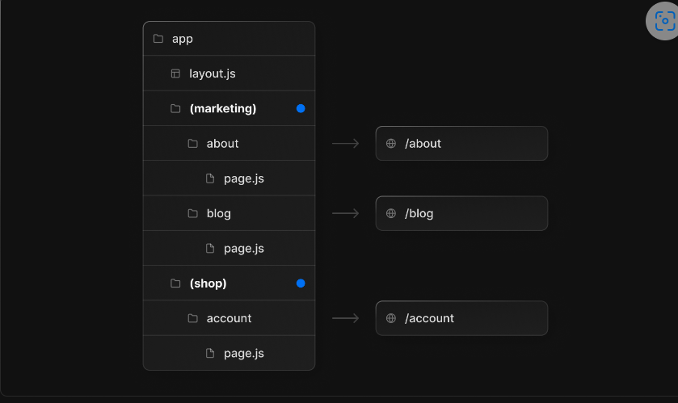

[toc]

# Routing

## 一. overview

### 1. The `app` Directory

- 默认情况下, 在`app`目录下的组件是`React Server Component`
- 在`page`目录下组件使用的是`React Client Component`


### 2. File Conventions

Next.js提供的所有特殊文件:

- `page.js`: 创建路由的唯一UI, 并使路径公开可访问
  - `route.js`: 为路由创建服务器端API端点
- `layout.js`: 为一段路由和其子元素创建共享的UI, layout会包装页面或子段
  - `template.js`: 与`layout.js`类似, 但在导航时会挂载新的组件实例, 除非需要这么做, 否则使用`layout.js`
- `loading.js`: `loading.js`会将页面及其子段包裹进React Suspense Boundary, 在页面加载的时候显示loading UI
- `error.js`: `error.js`会包裹页面及其子段进React Error Boundary, 当页面出现错误时, 展示这个page
  - `global-error.js`: 与`error.js`类似, 但是是应用在root根节点的`layout.js`上
- `not-found.js`: 创建UI, 以显示在路由段中抛出notFound函数或URL不匹配任何路由时的情况


### 3. Component Hierarchy(组件层次)


- 有子组件的情况下


### 4. Partial Rendering(局部渲染)

- Next.js会在客户端使用内存缓存来存储React Server Component的结果, 以便在未来的渲染中重用, 这种缓存是按路由分割的. 在收到请求后, 会检查是否已经缓存了所需的组件, 如果没有则会异步渲染, 重新获取; 由于每个组件都是分开单独渲染的, 所以整个页面不需要重新加载

- 在相邻routes导航时, next.js只会获取并渲染改变更新的部分, 不会重新获取刷新整个页面. 就是指在更新部分之上的`layout`会被保留


### 5. Dynamic Segments

- 形如: `app/blog/[slug]/page.js`, 在请求时进行内容填充或者在构建时进行预渲染
- 通过`params`prop传进`layout`, `page`, `route`和`generateMetadata`function

```js
// 通过接收参数params
export default function Page({ params }) {
  //  params = { slug: "..." }
  return <div>My Post</div>;
}
```

- 可以使用 [generateStaticParams()](https://beta.nextjs.org/docs/data-fetching/generating-static-params) 在构建时静态生成路由, 而不是在请求时按需生成


- `app/shop/[...slug]/page.js`会匹配`/shop/clothes`路由, 也会匹配`/sjop/clothes/tops`或者`/shop/clothes/top/t-shirts`


- 使用TypeScript

```tsx
export default function Page({
  params,
}: {
  params: { slug: string };
}) {
  return <h1>My Page</h1>;
}
```


### 6. Route  Groups

- 将一些特定的routes组合起来, 并且不会影响实际route
- 使用`(...)`命名文件夹的形式



- 注意在不同的Route Group中, 不能重名, 不然会造成错误

## 二. Pages and Layouts

### 1. Layout

- Layouts默认是Server Component, 但是也能设置为Client Component, 但是root Layout只能设置为Server Component
- 可以直接在里面使用`<head>`标签进行内置SEO优化

```tsx
export default function RootLayout({ children }: {
  children: React.ReactNode;
}) {
  return (
    <html lang="en">
      <body>{children}</body>
    </html>
  );
}
```


### 2. Templates

- `template`和`layout`相似, 都会包裹每个子布局或页面. 与`layout`不同的是, `template`会在每次导航时都为每个子元素创建一个新的实例(重新生成), 意味着新实例会被重新挂载, DOM元素会被重新创建, 状态(state)不会被保留, 副作用(effects)会重新同步
- 因此可以在特定行为中使用`template`


### 3. Modifying `<head>`

- 你可以在`layout.js`或`page.js`文件中导出一个`metadata`对象或者`generateMetadata`函数
- 最好通过[Metadata API](https://beta.nextjs.org/docs/api-reference/metadata)操纵head, 而不要直接在root的layout中修改head, 因为使用API会自动处理高级需求, 例如: 流式传输和去重`<head>`元素

```tsx
// app/page.tsx
export const metadata = {
  title: 'Next.js'
};

export default function Page() {
  return '...'
}
```


## 三. Linking and Navigating

- Next.js使用的是服务器中心路由(server-centric routing)和客户端导航(client-side navigation)
- 在服务器中心路由中, 客户端无需下载路由映射, 可以使用相同的请求来查找路由的服务器组件
- 虽然路由是以服务器为中心的, 但是路由器使用带有Link组件的客户端导航, 类似于SPA应用程序的行为, 因此当用户导航到新路由时, 浏览器不会重新加载页面, 相反URL会被更新, next.js只会渲染改变的地方
- 随着用户在应用程序中进行导航, router会在内存中客户端缓存存储Server Component负载的结果. 缓存由路由段拆分, 同时允许在任何级别进行无效化