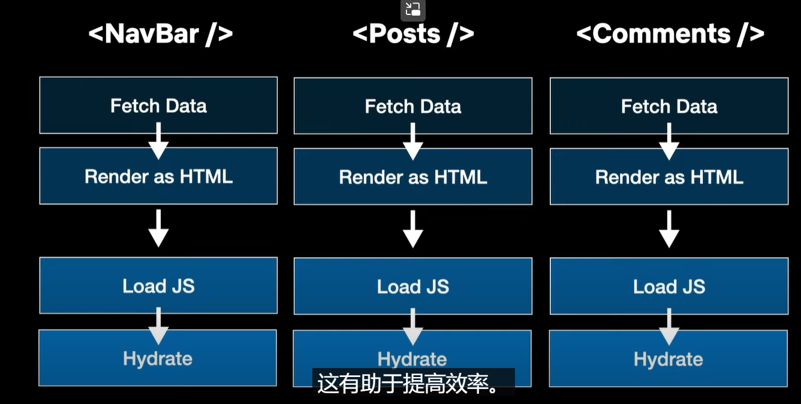

[toc]

# React18 + SSR

## 一. 简单介绍

- 在React中创建SSR应用, 需要**调用ReactDOM.hydrateRoot函数, 而不是ReactDOM.createRoot**
  - hydrateRoot: 创建一个水合Root, 是在激活模式下渲染App
    - **可以直接renderToString() jsx语法的App组件, 不一定要调这个函数**
  - createRoot: 创建一个Root, 接着调用其render函数将App直接挂载到页面上
- **服务器端可用ReactDOM.renderToString来进行渲染**


## 二. 搭建项目

```shell
npm i express
npm i webpack webpack-cli webpack-merge webpack-node-externals
npm i react react-dom
npm i nodemon -D
npm i babel-loader @babel/preset-react @babel/preset-env
```

### 1. Router

```jsx
// 入口文件: index.js
const express = require('express')
import React from "react"
import ReactDOM from "react-dom/server"
import { StaticRouter } from "react-router-dom/server"
import App from "../app.jsx"
import { Provider } from "react-redux"

const server = express()
server.get("/", (req,res) => {
    const AppHtmlString = ReactDOM.renderToString(
        // 1. 服务器端使用Redux
        <Provider store={store} />
            // 2.服务器端使用路由, 并指定初始渲染页面
            <StaticRouter location={req.url} >
                <App />
            </StaticRouter>
        </Provider>
    )
    
    res.send(``)
})
```

```jsx
// client 客户端
import ReactDOM from "react-dom/client"
import { BrowserRouter } from "react-router-dom"
import { Provider } from "react-redux"

ReactDOM.hydrateRoot(document.getElementById("root"),
	// 1. 客户端使用Redux
	<Provider store={store}/>
		// 2. 客户端使用Router
        <BrowserRouter>
            <App />       
        </BrowserRouter>
	</Provider>
)
```


### 2. 状态共享(Redux)

```shell
npm i react-redux @reduxjs/toolkit
```


## 三. hydrateRoot

### 1. 定义

- `const root = hydrateRoot(domNode, reactNode, options?)`

### 2. 作用

- `hydrateRoot`让你在包含提前由`server`端渲染完成HTML的浏览器DOM节点中显示React组件,


- To hydrate your app, React will “attach” your components’ logic to the initial generated HTML from the server. Hydration turns the initial HTML snapshot from the server into a fully interactive app that runs in the browser.

```jsx
import './styles.css';
import { hydrateRoot } from 'react-dom/client';
import App from './App.js';

hydrateRoot(
  document.getElementById('root'),
  <App />
);

```


- hydrate整个html

```jsx
function App() {
  return (
    <html>
      <head>
        <meta charSet="utf-8" />
        <meta name="viewport" content="width=device-width, initial-scale=1" />
        <link rel="stylesheet" href="/styles.css"></link>
        <title>My app</title>
      </head>
      <body>
        <Router />
      </body>
    </html>
  );
}
```

```jsx
import { hydrateRoot } from 'react-dom/client';
import App from './App.js';

hydrateRoot(document, <App />);
```


## 四. Suspense

### 1. pre-React 18面临的问题

- React在server端fetch数据的时候, 如果遇到响应比较"昂贵"的API时, 需要等到所有的数据都获取到了, 再生成静态HTML, 在这之前用户还是只能看到一块空白的屏幕, 而不是具有内容的静态HTML
- 在客户端加载JavaScript的时候, 部分组件比较复杂(如: `<Comments/>`评论), 在JavaScript没有完全加载完之前, 无法开始hydrate, 因为hydrate必须一次性执行完成
- 比较复杂的组件的hydrate也会耗费大量时间, 在全部的代码没有hydrate完成时, 整个页面都不具备交互性


### 2.作用

- 能够帮助我们**异步执行**, 异步的`fetch Data`, 异步的`Render as HTML`, 异步的`load js`, 异步的`Hydrate`
- **只要你将这个组件包裹在Suspense中**

```jsx
<Suspense fallback={<Loading/>} >
	<Comments />
</Suspense>
```




### 3. 主要特点

- **Streaming HTML**
  - 在server端, 需要获取复杂数据的组件上使用时, 返回静态HTML包含的是fallback中的组件, 不会再耗时等待数据返回, **当数据返回时, React会利用这个数据生成HTML, 并将它送到相同的流中, 并添加上一个`<script/>`保证传输的位置没有问题**, 甚至这个过程可以发生在客户端加载完JS之前
- **Selective Hydration**
  - 会优先hyrate你点击的组件, 暂停现在手上的工作. 当然没有被包裹在`Suspense`中的同步组件, 会全部一次性的hydrate
