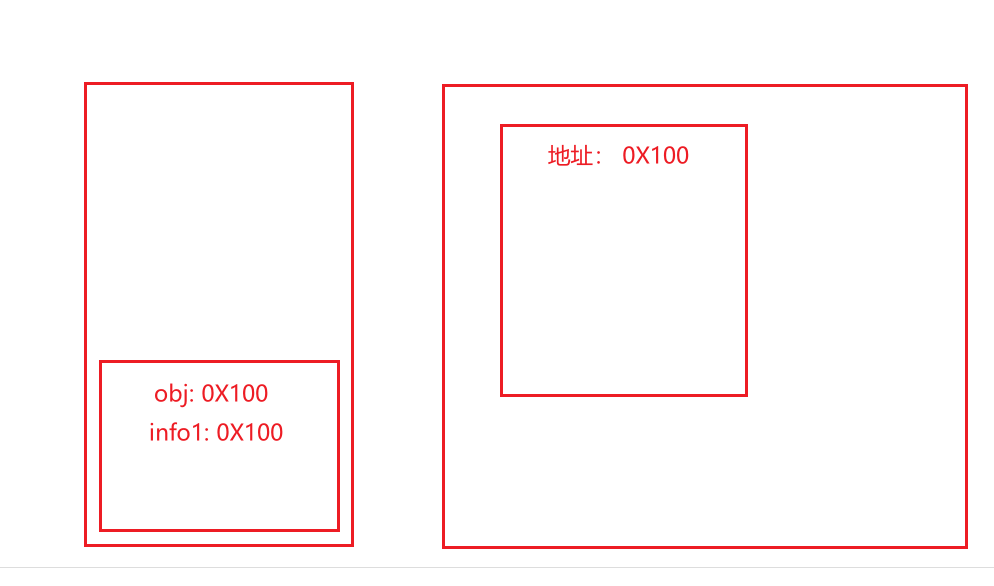
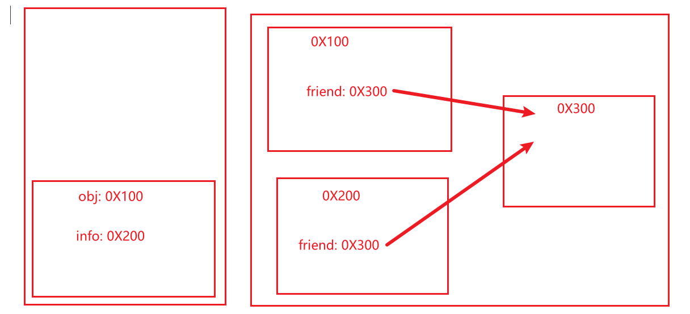

[toc]

# 深拷贝和浅拷贝

## 一.引用赋值

### 1. 介绍

```js
const obj = {
    name: "zzt"
}

const info1 = obj
obj.name = "zz"

// info1.name -> "Zz"
```



两个变量保存的是相同的地址信息, 因此通过一个变量改变时, 另一个变量取到的值也会发生变化

### 2. 在函数中使用引用赋值

- 将一个对象直接交给函数作为参数, 实际是将它对对象的引用传入进去, 即**该对象在内存中的地址**, 形参和实参都指向了内存中的同一块地址

```js
function update(obj) {
  obj = { prop: "updated" };
}

const obj = { prop: "original" };
update(obj);
console.log(obj.prop); // 输出 "original"
```

```js
function update(obj) {
  obj.prop = "updated";
}

const obj = { prop: "original" };
update(obj);
console.log(obj.prop); // 输出 "updated"
```


## 二. 浅拷贝

- 会生成一个全新的对象, **但只有第一层的拷贝**, 如果一个属性指向一个对象，那么浅拷贝的两个对象的属性都指向相同的内存地址
  - `...`: 扩展运算符
  - `Object.assign({},obj)`: 合并生成一个新对象

```js
const obj = {
    name: "zzt"
}

const info = {
    ...obj
}
// 或则 const info = Object.assign({},obj)

info.name = "zz"

// obj.name => "zzt"
```




## 三. 深拷贝

- 借助一些第三方库
- JSON: `const info = JSON.parse(JSON.stringify(obj))`
  - 对一些特殊的属性不会解析
    - 函数
    - Symbol

  - 不能处理循环引用， 会直接报错

- `window.structuredClone(obj1)`: 浏览器支持的原生的API
  
- 自己编写实现(JavaScript暂时没提供深拷贝的方法)

```js
function isObject(value) {
    const valueType = typeof value
    return ( value !== null ) && ( valueType === "object" || valueType === "functioni" )
}

function deepCopy(originValue){
    // 1. 判断当传入的不是对象时, 把原值返回
    if(!isObject(originValue)) return originValue
    //  (优化)判断是否是Set类型的实例
    // if(originValue instanceof Set){
    //			
	//	}
    
    // 2.判断是数组还是对象, 同时新建一个数组或对象
    const newObj = Array.isArray(originValue) ? [] : {}
    for (const key in originValue){
        // 3. 这里利用了递归
        newObj[key] = deepCopy(originValue[key])
    }
    return newObj
}
```

```js
// 解决循环引用(一个属性指向对象本身), 伪代码
function deepCopy(originValue, map = new WeakMap()) {
    // if(typeof originValue === "symbol") ...
    
    if(map.get(originValue)){
        return map.get(originValue)
    }
    
    const newObj = Array.isArray(originValue) ? [] : {}
    map.set(originValue,newObj)
    for(const key in originValue){
        newObj[key] = deepCopy(originValue[key],map)
    }
}
```


