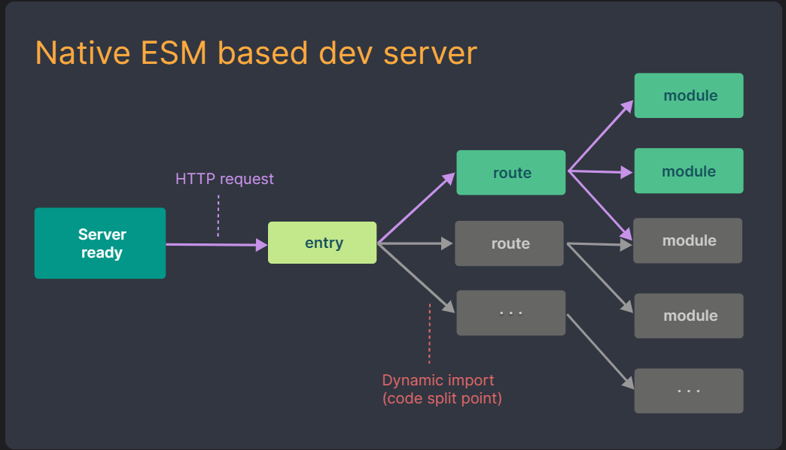

[toc]

# 快速开发工具vite

- 随着项目的越来越大, 需要处理的JavaScript呈指数级增长, 模块也越来越多, 传统的构建工具可能需要很多时间才能开启服务器, HMR也需要几秒钟才能在浏览器中反映出来

## 一. vite特点

- **一个开发服务器**: 它基于原ES模块提供了丰富的内建功能, 在**开发阶段(使用ESBuild预构建依赖)**不必将代码全都转换为ES5, 可以只进行简单的转换, 因此HMR的速度非常快
- **一套构建指令, 在生产阶段**, 使用rollup转换代码, 并且是预配置的, 可以输出生产环境的优化过的静态资源
  - 开发时使用ESBuild

  - 生产时使用rollup, 因为rollup相对更加灵活, 且对插件的支持更加广泛

- **会在源文件中进行转换, 并利用connect库构建出来的服务器将转换后的文件进行转发**

- vite是基于ESM执行的, 并以原生ESM的方式提供源码, 将一部分工作移交到浏览器上. 并且在浏览器要求源码时也是按需提供, 因为浏览器现在也支持ESM
  - 在HMR时, 因为vite是基于ESM实现的, 它只需要使已编辑模块与其最近的HMR边界之间的链失活, 尽可能降低了对别的模块的影响, 因此无论应用大小, HMR都能保持快速更新

- 使用HTTP来加速整个页面的重新加载(再次让浏览器为我们做更多的事情), 依赖的模块会进行缓存, 一旦被缓存了它们将不需要再次请求





## 二. Vite对css的支持

- vite可以直接支持css的处理, 直接导入css即可

- vite可以直接支持css预处理器, 比如less

  - 直接导入less
  - 之后安装less编译器

  ```shell
  npm install less -D
  ```

- vite直接支持postcss的转换

  - 只需要下载postcss, 并且配置postcss.config.js

  ```shell
  npm install postcss postcss-preset-env -D
  ```

  

## 三. Vite对TypeScript, React的支持

- vite对TypeScript是原生支持的, 它会直接使用ESBuild来完成编译
  - 只需要直接导入即可
- 如果查看浏览器中的请求下载, 会发现请求的依然是ts代码
  - 这是因为vite中的服务器Connect会对我们的请求进行转发
  - 获取ts编译后的代码, 给浏览器返回, 浏览器可以直接进行解析


 

- .jsx和.tsx文件同样开箱即用, 它们也是通过ESBuild来完成编译的
  - 所以我们只需要直接编写react的代码即可


## 四. Vite对vue的支持

- 使用`@vitejs/plugin-vue`插件

```js
// vite.config.js
import { defineConfig } from 'vite'
import vue from '@vitejs/plugin-vue'

export default defineConfig({
    plugins: [
        vue()
    ]
})
```


## 五. Vite打包

```shell
npx vite build  # 打包
npx vite preview # 开启预览打包后文件的服务器
```


## 六. Vite脚手架

```shell
npm creat vite
```


## 七. ESBuild

- ESBuild相对传统的构建工具, 构建速度相当快
- **因为其是使用Go语言编写的, 可以直接转换为机器代码, 而无需经过字节码**
- ESBuild可以充分利用CPU多核, 尽可能让它们饱和运行
- ESBuild的所有内容都是从零编写的(不使用第三方库), 从一开始就考虑了各种性能问题
- 可以将TS转译到JS, 速度远远快于tsc; 同时也能将JSX转译到JS, 速度也非常快