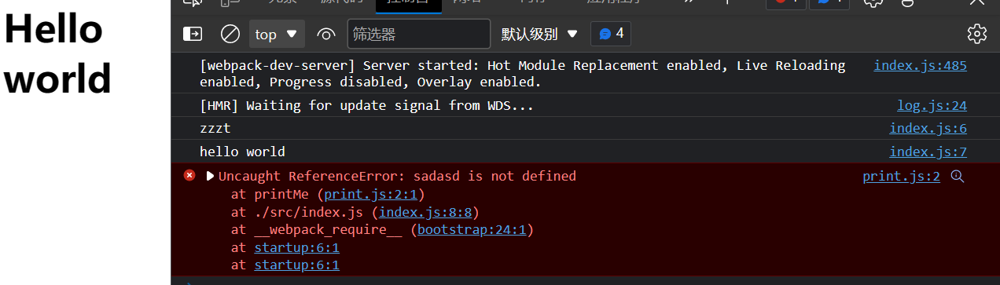

[toc]

# Webpack

[ webpack 中文文档 ](https://www.webpackjs.com/concepts/)

Webpack是跑在node环境里的

```shell
npm i webpack webpack-cli -D # 一般为局部安装, webpack-cli是为了利用命令行
npx webapck # 使用局部的webpack, 不然回去全局环境下寻找webpack
```

```json
"script": {
    "build": "webpack"  // 在package.json中不需要使用npx, 因为它会默认到bin目录下寻找命令
}
```

```js
const path = require('path')

module.exports = {
    entry: './src/main.js',
    output: {
        path: path.resolve(__dirname,'./build')
        filename: 'bundle.js'
    }
}
```


## 1. node中的内置模块path

[Path ](https://nodejs.org/docs/latest-v17.x/api/path.html)

- path: path模块对路径和文件进行处理
  - `__dirname`: 拿到文件的父文件夹名
  - `extname`: 拿到文件后缀名
  - `basename`: 获取文件名
  - `path.join([...paths])`: 将两个路径拼接在一起
  - `path.resolve([...paths])`: 将多个路径拼接在一起, 最后一定返回一个绝对路径, 从右往左,直到遇到"/", 如果还没得到绝对路径, 则和当前路径(目录不包括当前文件)进行拼接


## 2. webpack loader

- 帮助webpack处理对应类型的文件(.css, .vue ....)

```js
module.exports = {
    // 处理模块文件
    module: {
        // 定义规则
        rules: [
            {
                // 确定后缀名
             	test: /\.css$/,
                use: [
                    // loader的生效顺序是从后往前
                    { loader: "style-loader", options: {} },
                    { loader: "css-loader" },
                    { loader: "postcss-loader",
                      options: {
                          postcssOptions: {
                              plugins: [
                                  "autoprefixer"
                              ]
                          }
                      }
                    }
                ]
                // 简写: use: ["style-loader","css-loader",""] 不需要其他属性时
            },
            {
                test: /\.js$/,
                use: []
            }
        ]
    }
}

// npm install css-loader -D
```

- **css-loader**只负责解析css
- **style-loader**负责将css style插入到页面内
- **postcss-loader**: 是一个通过Javascript来转换样式的工具
  - 进行一些css的转换和适配, 如: 添加浏览器前缀, css样式重叠
  - **可以看成CSS中的babel**


## 3. asset module type(资源模块类型)

- **资源模块类型(asset module type) 是用来替代一些loader的(也可以理解为解析特殊文件的loader)**, 如: `raw-loader`, `url-loader`, `file-loader`
- 4种新的模块类型
  - **asset/resource**: 发送一个单独的文件并导出URL, 需要额外的网络请求
  - asset/inline 导出一个资源的data URI, 利用了浏览器可识别的**编码base64**, 编码的结果放到一个js文件内
  - asset/source 导出资源的源代码(用的少)
  - asset 在导出一个data URI 和发送一个单独的文件之间自动选择(文件大小)
    - 添加parser属性, 并且制定dataURL的条件, 添加maxSize属性

```js
module.exports = {
    module: {
        rules: [
            {
                test: /\.(png|jpe?g|svg|gif)$/,
                type: "asset"
                parser:{
                	dataUrlCondition: {
                		// 决定什么样的图片需要单独url打包
            	    	maxSize: 100 * 1024
           	 		}
            	},
            	generator: {
            		// 占位符: []; name: 原来的图片的名字; ext: 原来图片的后缀名
            		// hash:X webpack生成的哈希值
            		// img/ 生成一个文件夹
            		filename: "img/[name].[hash:6][ext]"
            	}
            },
    		{
    			 test: /\.js$/,
    			 use: ["babel-load"],
    			// 或者直接
    			 loader: 'babel-loader'  // 但是babel想要起作用, 还需要使用预设presets或者插件
			}
        ]
    }
}
```

- 当使用babel要转换的内容过多(打的补丁过多), 可以使用预设, 避免一个一个的设置, webpack会根据我们的预设来加载对应的插件列表, 并且将其传入babel

```yaml
npm install @babel/preset-env -D
```

常见预设: 

- env
- react
- TypeScript


## 4. resolve模块解析

- **resolve用来设置模块如何被解析, 帮助webpack从每个(require/import)语句中, 找到需要引入到合适的模块代码**
- webpack使用enhanced-resolve来解析文件路径


主要功能: **导入文件,文件夹; 别名**

- 如果引入的是文件(文件具有扩展名),则直接打包文件, 负责使用`resolve.extensions`选项作为文件扩展名解析
- 如果引入的是一个文件夹: 则会根据`resolve.mainFiles`配置选项中指定的文件顺序查找
  - `resolve.mainFiles`的默认值是'['index']'
  - 再根据`resolve.extensions`来解析扩展名

```js
module.exports = {
    resolve: {
        extensions: [".js",".json",".vue",".ts",".tsx"]
        alias: {
        	"@": path.resolve(__dirname,"./src/components")
    	}
		mainFiles: ['index']
    }
}
```


## 5. Plugin插件

#### 5.1 Plugin与loader的区别

- Loader主要用于处理模块, Loader用于处理非JavaScript文件(如: 上面的CSS和图片等), 将其转换为Webpack可识别的模块, 并将这些模块打包到最终的JavaScript文件中.
  - 如通过`style-loader`和`css-loader`将CSS文件打包到了JavaScript文件中, 一遍在浏览器中云信

- Plugin可以作用于**更广泛的任务**,Webpack打包的过程不仅仅是将多个模块打包成为一个JavaScript文件,  还包括比如打包优化, 资源管理, 环境注入, 压缩, 代码分割等复杂的过程, 因此Plugin可以执行的任务范围更大 

### 5.2 cleanWebpackPlugin

- **CleanWebpackPlugin**: 自动删除打包前的旧的文件夹

```js
const { CleanWebpackPlugin } = require("CleanWebpackPlugin")

module.exports = {
    plugins: [
        new CleanWebpackPlugin()
    ],
    outdir: {
        path: path.resolve(__dirname,'./build'),
        filename: 'bundle.js',
        // 与cleanWebpackPlugin的作用相同
        clean: true
    }
}
```


### 5.3 HtmlWebpackPlugin

- HtmlWebpackPlugin: 打包文件夹下自动生成html文件, 使用方式于上面相同, 可以在new时进行配置 
  - 在html中可以利用`<%= htmlWebpackPlugin.options.title %>`来拿到定义的变量
  - 所有的bundle都会被自动添加到html中, 不需要在模板中手动导入`<script>`等脚本

```html
<!DOCTYPE html>
<html lang="en">
<head>
    <meta charset="UTF-8">
    <meta http-equiv="X-UA-Compatible" content="IE=edge">
    <meta name="viewport" content="width=device-width, initial-scale=1.0">
    <title>Document</title>
</head>
<body>
    <h1>Hello world</h1>
    <!-- 不需要这样手动导入, 会自动导入  -->
    <!-- <script src="<%= htmlWebpackPlugin.options.publicPath %>/dist/bundle.js" ></script> -->
</body>
</html>
```


### 5.4 DefinePlugin

- **DefinePlugin**

  - 可以用来定义环境变量, 允许我们在编译时创建配置的全局常量, 是一个内置插件
  - 会在代码打包时, 查找指定的变量名, 并将其替换为指定的值

  ```js
  // webpack.config.js
  const webpack = require('webpack');
  
  module.exports = {
    // ...
    plugins: [
      new webpack.DefinePlugin({
        'process.env.API_URL': JSON.stringify('http://localhost:3000/api')
      })
    ]
  };
  
  // app.js
  fetch(process.env.API_URL + '/users')
    .then(response => response.json())
    .then(data => console.log(data));
  
  ```

  ```js
  const API_URL = 'http://localhost:3000/api';
  
  fetch(API_URL + '/users')
    .then(response => response.json())
    .then(data => console.log(data));
  ```

  


## 6. mode(运行环境)

- 告诉webpack目前处于什么环境, 使用相应模式的**内置优化**
- 默认值时production
- 可选值有: "none" | "development" | "production"

| 选项        | 描述                                                         |
| ----------- | ------------------------------------------------------------ |
| development | 会将DefinePlugin中的process.env.NODE_ENV设置为development, 为模块和chunk启用有效的名称 |
| produnction | 会将DefinePlugin中的process.env.NODE_ENV设置为production,为模块和chunk启用混淆的名称(防止别人看到源文件名称) |
| none        | 不做什么操作                                                 |


## 7. manifest

- 通过manifest, webpack和webpack插件"知道"应该生成哪些文件, 它通过追踪所有的模块到输出bundle之间的映射

- 通过`WebpackManifestPlugin`插件, 可以将manifest数据提取为一个JSON文件以供使用


## 8. source map

- 作用是即使将比如三个源文件`a.js`, `b.js`, `c.js`打包到了一个`bundle.js`中, 如果其中的一个源文件出现了错误, 那么堆栈也能直接定位到源文件, 而不是`bundle.js`



```js
module.exports = {
    devtools: "inline-source-map"
}
```


## 9. 代码分离

- 具体见`webpack性能优化方案`

常见的代码分离方法:

- **入口起点**: 使用`entry`配置手动的分离代码
- **防止重复**: 使用`Entry dependencies`或`SplitChunksPlugin`去重和分离chunk
- **动态导入**: 通过模块的内联函数调用来分离代码

### 1. 入口起点

```js
module.exports = {
    entry: {
        index: './src/index.js',
        another: './src/another-module.js'
    },
    output: {
        filename: '[name].bundle.js'  // index, another会填入name, 生成两个文件
    }
}
```

### 2. 防止重复


### 3. 动态导入


## 10. 缓存

- 通过浏览器的缓存技术, 可以通过命中缓存, 以降低网络流量, 使网站的加载速度更快
- 但当我们在部署新版本的时候, 如果没有更改资源的文件名, 浏览器可能会认为它没有被更新, 就会使用它的缓存版本. 因此在莫种程度上由于缓存的存在, 当你需要获取新的代码时, 就会变得棘手
- 可以通过适当的配置使`webapck`编译生成的文件能被客户端缓存, 并且在文件内容发生变化后, 能请求到新的文件
  - 设置`output.filename`中的`substitutions`, 根据文件的内容创建出唯一的hash, 当资源发生变化时, [contentHash]也会发生变化

```js
module.exports = {
    output: {
        filename: '[name].[contenthash].js' // 其中contenthash会随着文件内容的变化而变化
    }
}
```

- 每个chunk的`module.id`的变化会默认随着解析顺序(resolve order)进行增量, 这种情况可能导致文件的内容没发生变化, 但`[contenthash]`还是发生了变化

```js
const path = require('path');
  const HtmlWebpackPlugin = require('html-webpack-plugin');

  module.exports = {
    entry: './src/index.js',
    plugins: [
      new HtmlWebpackPlugin({
        title: 'Caching',
      }),
    ],
    output: {
      filename: '[name].[contenthash].js',
      path: path.resolve(__dirname, 'dist'),
      clean: true,
    },
    optimization: {
    // 使每个模块的moduleId保持确定
     moduleIds: 'deterministic',
        
      runtimeChunk: 'single',
      splitChunks: {
        cacheGroups: {
          vendor: {
            test: /[\\/]node_modules[\\/]/,
            name: 'vendors',
            chunks: 'all',
          },
        },
      },
    },
  };
```


## 11. 创建library

```js
 const path = require('path');

  module.exports = {
    entry: './src/index.js',
    output: {
      path: path.resolve(__dirname, 'dist'),
      filename: 'webpack-numbers.js',
      library: "webpackNumbers",    // 配置暴露从入口导出的内容
      type: 'umd'
    },
  };
```

```html
<!-- 这样就能获取到打包后的文件 -->
<script src="https://example.org/webpack-numbers.js"></script>
<script>
  // 利用配置的导出的内容, 使用webpack-numbers.js中的内容
  // Global variable
  window.webpackNumbers.wordToNum('Five');
</script>
```

```js
// CommonJs module
const webpackNumbers = require('webpack-numbers');
// ...
webpackNumbers.wordToNum('Two');
```

```js
// AMD module 
require(['webpackNumbers'], function (webpackNumbers) {
  // ...
  webpackNumbers.wordToNum('Two');
});
```


## 12. 环境变量(--env)

- 命令行环境配置: `--env`, 配置的环境变量可以在`webpack.config.js`中访问
  - 通过`env.production`访问

```shell
npx webpack --env goal=local --env production --progress
```

```js
const path = require('path');

module.exports = (env) => {
  // Use env.<YOUR VARIABLE> here:
  console.log('Goal: ', env.goal); // 'local'
  console.log('Production: ', env.production); // true

  return {
    entry: './src/index.js',
    output: {
      filename: 'bundle.js',
      path: path.resolve(__dirname, 'dist'),
    },
  };
};
```


## 13. 依赖管理

- 使用`require()`会被webpack解析, 生成的`context module`(上下文模块), 它会包含目录下所有模块的引用
- 如使用`require('./template' + name + '.ejs')`, 会生成`map`, 将所有符合的模块包含进来

```js
{
     "./table.ejs": 42,
  	 "./table-row.ejs": 43,
  	 "./directory/another.ejs": 44
}
```

### 1. require.context

- 可以使用`require.context`来创建自己的context, webpack会在构建中解析

```js
require.context(
  directory,					// 要搜索的目录
  (useSubdirectories = true),	// 是否还搜索该目录的子目录
  (regExp = /^\.\/.*$/),		// 匹配文件的正则表达式
  (mode = 'sync')
);
```

- 输出是一个`require`函数, 可以接收一个参数`request`, 此函数有三个属性
  - `resolve`: 也是一个函数, 返回request解析后得到的模块id
  - `keys`: 也是一个函数, 返回一个数组, 获取上下文中所有的模块相对路径(相对解析的文件夹), 遍历每个模块并执行相应的操作
    - 如果想要引入一个文件夹下所有的文件, 这个功能比较有用
    - 它返回的数组中只是`key`, 需要获得完整的导出对象, 还得使用`require`
    - 可以使用`context(key)`执行模块内的代码逻辑

```js
const cache = {};

function importAll(r) {
  r.keys().forEach((key) => (cache[key] = r(key)));
}

importAll(require.context('../components/', true, /\.js$/));
// 在构建时(build-time)，所有被 require 的模块都会被填充到 cache 对象中。
```

```js
const context = require.context('./template', true, /\.js$/)
context.keys().forEach(key => {
  console.log(key)      // 返回./route_1.js 和 ./route_2.js(相对路径)
  context(key)			// 
    }
)
```

```js
// 具体实例, 动态路由加载
export function mapMenusToRoutes(userMenus: any[]): RouteRecordRaw[] {
  const routes: RouteRecordRaw[] = []

  // 1.先默认拿取所有RouteRecordRaw映射,并将其放入一个数组中
  const allRoutes: RouteRecordRaw[] = []
  // 1.1 通过webpack的一个方法找到对应文件夹下所有的映射文件,并将其视为一整个抽象对象
  const routeFiles = require.context('../router/main', true, /\.ts/)
  // 1.2 通过抽象对象的方法keys(),拿到所有文件相对'main'的相对路径
  // 如：'./analysis/overview/overview.ts'
  routeFiles.keys().forEach((key) => {
    // 1.3 先将这个相对路径进行整合,拿到相对当前文件的路径,再利用require函数拿到文件Module对象 
    const route = require('../router/main' + key.split('.')[1])
    // 1.4 将拿到的Module对象的默认导出对象push到allRoutes数组中
    allRoutes.push(route.default)
  })
  // 2.定义一个递归函数,根据menuList获取需要添加的routes,进行权限管理显示哪些页面
  const _recurseGetRoute = (menus: any[]) => {
    for (const menu of menus) {
      // type = 2则进行判断, type = 3 是页面内的一些权限设置
      if (menu.type === 2) {
        // 通过判断RouteRecordRaw中的path是否等于menu数据中的url来判断用户是否具有这个权限
        const route = allRoutes.find((route) => route.path === menu.url)
        if (route) routes.push(route)
        // firstMenu时拿到第一个页面的RouteRecordRaw,避免进入/main时页面无显示
        if (!firstMenu) firstMenu = route
      } else {
        // menu.type = 1 继续遍历其children
        _recurseGetRoute(menu.children)
      }
    }
  }

  _recurseGetRoute(userMenus)
  // 3. 返回符合权限的RouteRecordRaw[]
  return routes
}
```


## 14. shimming预置依赖

使用场景

- 对一些可能会创建一些需要导出的全局变量的libray(不符合规范的模块) , 进行合理化处理
- 当`polyfill`扩展浏览器能力, 来支持更多的用户时, 可以将这些polyfill提供给需要(patch)的浏览器, 也就是实现按需加载

### 1. 预置全局变量

- 可以通过`ProvidePlugin`插件, 把应用程序中的模块依赖改为一个全局变量依赖
  - 在webpack编译的每个模块中, 通过访问一个变量来获取一个package

```js
// webpack.config.js
const path = require('path');
const webpack = require('webpack');

 module.exports = {
   entry: './src/index.js',
   output: {
     filename: 'main.js',
     path: path.resolve(__dirname, 'dist'),
   },
  plugins: [
    new webpack.ProvidePlugin({
      _: 'lodash',				// 如果遇到一处用_作为变量的模块实例. 就将loadsh package引
        						// 入进来, 并将其提供给需要用到它的模块
    }),
  ],
 };
```

```js
const path = require('path');
 const webpack = require('webpack');

 module.exports = {
   entry: './src/index.js',
   output: {
     filename: 'main.js',
     path: path.resolve(__dirname, 'dist'),
   },
   plugins: [
     new webpack.ProvidePlugin({
      join: ['lodash', 'join'],  // 这样当模块中使用join方法时, 可以直接使用loadsh中的join
         						 // loadsh中的其余方法都会被tree shaking掉
     }),
   ],
 };
```


### 2. 加载polyfill

```diff
 const path = require('path');
 const webpack = require('webpack');

 module.exports = {
-  entry: './src/index.js',
+  entry: {
+    polyfills: './src/polyfills',
+    index: './src/index.js',
+  },
   output: {
-    filename: 'main.js',
+    filename: '[name].bundle.js',
     path: path.resolve(__dirname, 'dist'),
   },
   module: {
     rules: [
       {
         test: require.resolve('./src/index.js'),
         use: 'imports-loader?wrapper=window',
       },
       {
         test: require.resolve('./src/globals.js'),
         use:
           'exports-loader?type=commonjs&exports[]=file&exports[]=multiple|helpers.parse|parse',
       },
     ],
   },
 };
```

- 注意:　**判断是否加载polyfill的逻辑应该放在所有代码之前**, 因此可以添加一个script脚本在`dist/index.html`中, 放在引入的script之前

```js
// 将polyfill单独打包出来后, 可以通过一些条件判断是否加载读入polyfill.bundle.js
const modernBrowser = 'fetch' in window && 'assign' in Object;

if (!modernBrowser) {
    const scriptElement = document.createElement('script');

    scriptElement.async = false;
    scriptElement.src = '/polyfills.bundle.js';
    document.head.appendChild(scriptElement);
}
```


## 15. TypeScript

### 1. 安装

```shell
npm install typescript ts-loader -D
```

- 如果使用了`@babel/preset-typescript`, 那么就让babel同时处理JavaScript和TypeScript, 不需要再额外使用一个loader
  - 与`ts-loader`相反, babel底层的`@babel/plugin-transform-typescript`不进行类型检测, 只进行类型转换


## 2. 配置

```js
// webpack.config.js
const path = require('path');

module.exports = {
  entry: './src/index.ts',
  module: {
    rules: [
      {
        test: /\.tsx?$/,
        use: 'ts-loader',
        exclude: /node_modules/,
      },
    ],
  },
  resolve: {
    extensions: ['.tsx', '.ts', '.js'],
  },
  output: {
    filename: 'bundle.js',
    path: path.resolve(__dirname, 'dist'),
  },
};
```

- 开启source-map
  - 告知webpack提取这些source map, 并内联到最终的bundle中

```json
 {
    "compilerOptions": {
      "outDir": "./dist/",
     "sourceMap": true,  				// source map
      "noImplicitAny": true,
      "module": "commonjs",
      "target": "es5",
      "jsx": "react",
      "allowJs": true,
      "moduleResolution": "node",
    }
  }
```

```js
// webpack.config.js
module.exports = {
    devtool: "inline-source-map"
}
```


## 16. 公共路径(publicPath)

- 通过它来指定应用程序中所有资源的基础路径


- 添加`publicPath`后

```js
module.exports = {
    output: {
        publicPath: "./assets",
        ...
    }
}
```

```html
<!-- /dist/index.html -->
<!DOCTYPE html>
<html lang="en">
  <head>
    <!-- 所有的资源路径前都会加上./assets(publicPath) -->
    <script
      defer="defer"
      src="./assets/vendor-node_modules_lodash_lodash_js_vendor.js"
    ></script>
    <script defer="defer" src="./assets/bundle.js"></script>
  </head>
  <body>
  </body>
</html>
```

```html
<!-- 这是不添加publicPath后的结果, 作为对比 --> 
<script
      defer="defer"
      src="vendor-node_modules_lodash_lodash_js_vendor.js"
    ></script>
<script defer="defer" src="bundle.js"></script>
```


## 17. 资源模块类型(asset module type)

四种新的模块类型:

### 1. asset/resource

- `asset/resource`: 发送出一个单独的文件并导出URL, 之前通过`file-loader`实现
  - 会生成单独文件, webpack会将文件复制到输出目录, 并且bundle中会引入这个新生成的文件

```js
import img from './example.png';

const element = document.createElement('img');
element.src = img;				// JavaScript代码中设置好了src, 会自动填入复制文件的url
document.body.appendChild(element);
```


### 2. asset/inline

- `asset/inline`: 导出一个资源的data URI. 之前通过使用`url-loader`实现
  - 不会生成单独的文件, bundle中包含资源文件的data URI, 从而避免了向服务器额外的图片请求
- 主要用于小图片, SVG图标, 小的文本文件, 最好使用`maxSize`来限制内联文件的大小

#### 2.1 data URI

- data URI是一种将小型数据嵌入到URL中的方法. 通过将图片, css样式表和JavaScript脚本内联到HTML文件中, 减少HTTP请求, 从而提高页面加载速度
- 格式: `data:[<mediatype>][;base64],<data>`
  - `mediatype`: 数据的MIME类型: 如`image/jpeg`
  - `;base64`: 是否使用base64编码
  - `data`: 实际内容
- 使用:

```html
][;base64],<data>">
```

- 这个`img`标签不需要发送网络请求, 因为所需的资源以base64编码嵌入到了HTML或CSS代码中, 浏览器可以直接从代码中获取资源, 有效减少了对服务器的请求, 从而加快了页面加载速度, 但坏处是增加了HTML或CSS文件的体积, 并且使用data URI的图片不会被浏览器缓存


### 3. asset/source

- `asset/source`: 导出资源的源代码, 之前通过使用`raw-loader`实现
- 主要处理文本文件, 比如`.md`, `.txt`, 将文件作为源代码字符串处理, 并将其导出为JavaScript模块, 可以在应用程序代码中通过import导入使用, 会产生一个新的模块
- 所有`.txt`文件将原样注入到bundle中


### 4. asset

- `asset`:在导出一个data URI和发送一个单独的文件之间自动选择. 之前通过`url-loader`实现
- 小于8kb的文件, 会被视为`inline`模型类型, 否则会被视为`resource`模型类型


## 18. Manifest

- 当`compiler`开始执行, 解析和映射应用程序时, 它会保留所有模块的详细要点, 比如: 文件的名称, 路径, hash值等等, 建立模块和输出bundle之间的映射关系. 在Webpack打包过程中,`import`或`require`语句现在都已经转换为`__webpack_require__`方法, 此方法指向模块标识符, 同时Manifest会跟踪所有webpack打包生成的资源, 通过使用manifest中的数据, runtime将能够检索这些标识符, 找出每个数据符背后对应的模块

- 同时可以通过`WebpackManifestPlugin`插件, 可以将manifest数据提取为一个json文件以供使用

- 通过manifest, webpack可以快速地知道哪些文件被修改过, 哪些文件需要重新生成, 从而提高了应用程序的构建速度和性能
